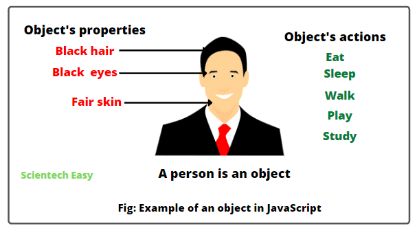
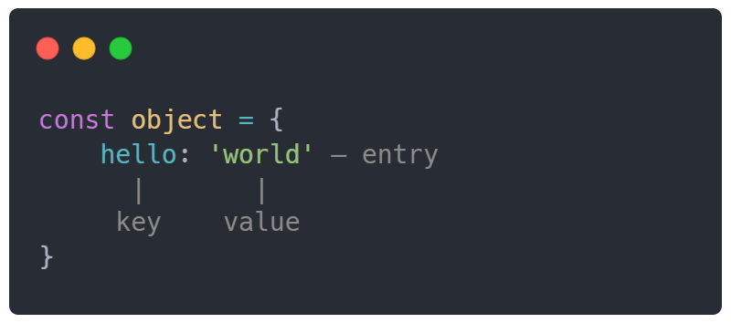
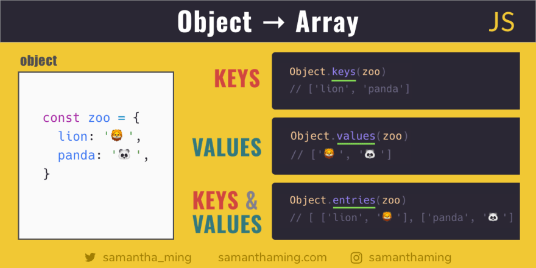
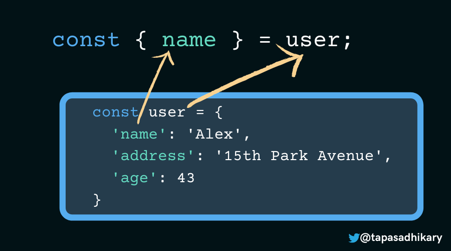

#  Object...
## If you didn't know: object is a collection of properties, and a property is an association between key and value
### There you can see object using in example:

## If you want to create an object  just know in JS they are represented as key & value pairs, values can be any type and any value, and last, for creating you must use {}

## The  Object.keys()static method returns string-keyed property names
## The  Object.values() static method returns string-keyed property values.
## The  Object.entries() static method returns a key-value pairs

## The destructuring assignment syntax is a JavaScript expression that makes it possible to unpack values from arrays, or properties from objects, into distinct variables.

## In ES6, you use the spread operator (...) to unpack elements of an array. The spread operator can be very useful to clone an array
